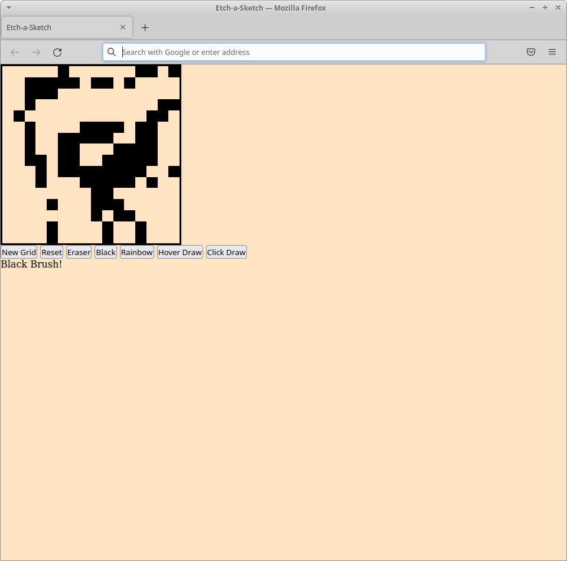

# etch-a-sketch

This project is an implementation of a 16x16 Etch-a-Sketch. The outline for the project can be found [here.](https://www.theodinproject.com/paths/foundations/courses/foundations/lessons/etch-a-sketch-project)

# Current Version

A demo of the current project can be found [here.](https://thejulianflores.github.io/etch-a-sketch/)

The current version of the project is a basic webpage with a 16x16 grid. The user must first choose a drawing option:

1. Hover to draw
2. Click to draw

The user must then choose a color option:

1. Black Brush
2. Rainbow Brush
3. Eraser Brush

The user can reset the grid to the default size with the "Reset" button.

The user can also create a grid of a custom size with the "New Grid" button.

### FEATURES

1. Reset button that empties the grid
2. Black or Rainbow pen option
3. Choose to "color by hover" or "color by click" 
4. Create a grid of a different size

Functionality is being implemented to:

1. Stylize the page

# Part 1: Understanding the Project

The finished product will be a 16x16 grid of white squares. When the user hovers their mouse over a box, the box will change to a random color value. 

A button will be on the site that will allow the user to clear the current grid and send the user a popup message asking for the side length of the new grid to be created.

The grid will allow a maximum width of 100.

# Part 2: Takeaways for Future Projects

One of the issues faced was that upon resetting the grid more than 5 times, the page began to slow down significantly. After debugging, the issue was that the event listeners were being created every time the user created a new grid and none were being removed. 

This issue has since been fixed. When the user erases a grid, the old event listeners are removed with it.